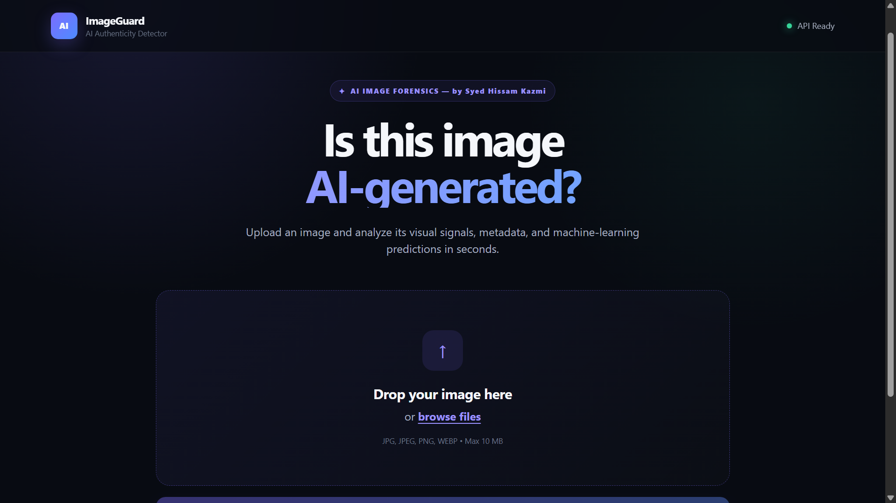

# AI Image Authenticity Detector


A full‑stack AI/ML portfolio project that analyses images and returns a **probabilistic estimate** of whether they were generated by artificial intelligence.

Built with **FastAPI**, **PyTorch**, **Hugging Face Transformers**, and **Pillow**, this project demonstrates production‑minded ML engineering:

- Modular detector architecture with two different vision models
- Performance‑tuned ensemble on a validation set
- Per‑model transparency in API responses
- Asynchronous concurrent inference
- Robust error handling and graceful degradation
- Automated tests, logging, evaluation, and a professional frontend

---

## 📚 Table of Contents

- [Overview](#overview)
- [Features](#features)
- [Tech Stack](#tech-stack)
- [AI Models](#ai-models)
- [Architecture](#architecture)
- [Evaluation](#evaluation)
- [Frontend](#frontend)
- [Quick Start](#quick-start)
- [API Reference](#api-reference)
- [Testing](#testing)
- [Configuration](#configuration)
- [Deployment Notes](#deployment-notes)
- [Project Structure](#project-structure)
- [Limitations](#limitations)
- [Roadmap](#roadmap)
- [Author](#author)
- [License](#license)

---

## Overview

The system accepts an image upload and returns a detailed JSON report containing:

- AI probability (`ai_probability`)
- Human probability (`human_probability`)
- Per‑model predictions (`model_predictions`)
- Confidence level (`LOW`, `MEDIUM`, `HIGH`)
- Detection signals
- Dominant colours
- EXIF metadata (when available)

The final result is intentionally **probabilistic**, not a definitive label.

---

## Features

| Feature | Description |
|--------|-------------|
| **Upload & Analyse** | `POST /analyze` accepts an image and returns a complete report |
| **Two‑Model Ensemble** | Weighted average of Ateeqq and wkaandemir |
| **Per‑Model Transparency** | Response includes individual model probabilities |
| **Dominant Colours** | Top 3 colours extracted from each image |
| **EXIF Metadata** | Camera details when available |
| **Auto‑Resizing** | Large images automatically reduced to 2048px |
| **Background Cleanup** | Temporary files deleted after response |
| **Rotating Logs** | Detailed logs in `logs/app.log` |
| **Graceful Fallback** | If one model fails, the other still returns a result |
| **Low‑Memory Mode** | Optional `ONLY_MODEL` environment variable for constrained deployments |

---

## Tech Stack

| Layer | Technology |
|-------|------------|
| Backend | FastAPI, Uvicorn |
| ML | PyTorch, Transformers, timm, safetensors |
| Image Processing | Pillow |
| Frontend | HTML, CSS, Vanilla JavaScript |
| Testing | pytest |
| Logging | Python `logging` with rotation |
| Version Control | Git + GitHub |

---

## AI Models

### Model 1: Ateeqq / SigLIP

- Hugging Face: [`Ateeqq/ai-vs-human-image-detector`](https://huggingface.co/Ateeqq/ai-vs-human-image-detector)
- Architecture: SigLIP image classifier
- Labels: `ai`, `hum`
- Approx. weights: 372 MB

### Model 2: wkaandemir / CLIP ViT

- Hugging Face: [`wkaandemir/ai-image-detector`](https://huggingface.co/wkaandemir/ai-image-detector)
- Architecture: CLIP ViT‑B/16 + merged LoRA
- Output: `p(real)` → converted to `p(ai) = 1 - p(real)`
- Approx. weights: 343 MB

### Ensemble

The ensemble is currently tuned to:

```text
Ateeqq weight: 0.47
wkaandemir weight: 0.53
```

These weights were selected using grid search on a small validation set.

If one model fails to load or predict, the other automatically becomes the sole contributor.

---

## Architecture

```text
                Browser
                   │
                   ▼
            FastAPI /analyze
                   │
                   ├── Validate image
                   ├── Resize if > 2048px
                   ├── Extract metadata
                   ├── Extract dominant colours
                   └── Run detectors concurrently
                           │
                ┌──────────┴──────────┐
                ▼                     ▼
        Ateeqq / SigLIP      wkaandemir / CLIP
                │                     │
           P(AI) = p1           P(AI) = 1 - P(real)
                │                     │
                └──────────┬──────────┘
                           ▼
                  Weighted ensemble
                           │
                    Final P(AI)
                           │
                           ▼
                   JSON response
```

---

## Evaluation

Evaluated on a small held‑out set of **32 images**.

| Model | Accuracy | Precision | Recall | F1 Score |
|-------|----------|-----------|--------|----------|
| Ateeqq | 0.719 | 0.800 | 0.762 | 0.780 |
| wkaandemir | 0.781 | 0.792 | 0.905 | 0.844 |
| **Tuned Ensemble** | **0.844** | **0.833** | **0.952** | **0.889** |

The tuning procedure is available in `scripts/tune_weights.py`.

> The evaluation set is small; further evaluation on a larger, more diverse dataset is recommended before production use.

---

## Frontend

The frontend is served by FastAPI at `/`.

### Includes

- Drag‑and‑drop image upload
- Image preview
- Animated AI probability gauge
- Confidence badge
- Per‑model prediction bars
- Dominant colour swatches
- Metadata and signals
- Disclaimer note

No external CSS/JS frameworks are used.




---

## Quick Start

### Prerequisites

- Windows 10/11, Python 3.12+
- Microsoft Visual C++ Redistributable for PyTorch on Windows

### 1. Clone and create environment

```powershell
git clone https://github.com/SyedHissamKazmi/ai-image-detector.git
cd ai-image-detector
python -m venv .venv
.\.venv\Scripts\Activate.ps1
python -m pip install --upgrade pip
```

### 2. Install dependencies

```powershell
python -m pip install torch torchvision --index-url https://download.pytorch.org/whl/cpu
python -m pip install -r requirements.txt
python -m pip install -r requirements-dev.txt
```

### 3. Start the server

```powershell
python -m uvicorn app.main:app --reload
```

### 4. Open the app

- Frontend: `http://127.0.0.1:8000/`
- API docs: `http://127.0.0.1:8000/docs`
- Health: `http://127.0.0.1:8000/health`

---

## API Reference

### `POST /analyze`

- Request: `multipart/form-data` with field `file`
- Response: `AnalysisResponse`

Example response:

```json
{
  "filename": "example.jpg",
  "format": "JPEG",
  "width": 1024,
  "height": 1024,
  "file_size_bytes": 506052,
  "ai_probability": 0.9738,
  "human_probability": 0.0262,
  "metadata_summary": {"Make": "Canon", "Model": "EOS R5"},
  "signals": ["ML ensemble: strong AI signal"],
  "confidence": "HIGH",
  "dominant_colors": ["#7B5539", "#CFCBC3", "#D1B79E"],
  "model_predictions": {
    "ateeq": 0.9999,
    "wkaandemir": 0.9477
  },
  "note": "Image analyzed. This result is probabilistic and should not be treated as definitive proof."
}
```

---

## Testing

Run:

```powershell
python -m pytest
```

The suite includes:

- API endpoint tests with mocked detectors
- Ensemble logic tests
- Confidence band tests

---

## Configuration

Configuration is managed by `pydantic-settings` and `.env`.

Key settings:

| Setting | Description | Default |
|---------|-------------|---------|
| `MAX_FILE_SIZE` | Maximum upload size | `10 MB` |
| `MAX_IMAGE_DIMENSION` | Auto‑resize threshold | `2048` |
| `LOG_FILE` | Rotating log file | `logs/app.log` |
| `DOMINANT_COLOR_COUNT` | Number of colour swatches | `3` |

---

## Deployment Notes

The full ensemble loads ~715 MB of model weights. On low‑memory containers, use:

```text
ONLY_MODEL=wkaandemir
```

This loads only the wkaandemir detector and reduces memory usage.

```powershell
$env:ONLY_MODEL = "wkaandemir"
python -m uvicorn app.main:app --host 0.0.0.0 --port 10000
```

For temporary public demos without a card, `ngrok` can be used:

```powershell
ngrok http 8000
```

---

## Project Structure

```text
ai-image-detector/
├── app/
│   ├── main.py
│   ├── api/
│   │   ├── routes.py
│   │   └── schemas.py
│   ├── services/
│   │   └── analyzer.py
│   ├── detector/
│   │   ├── base.py
│   │   ├── ateeq_detector.py
│   │   ├── wkaandemir_detector.py
│   │   └── model.py
│   └── core/
│       ├── config.py
│       └── logging_config.py
├── frontend/
│   ├── index.html
│   ├── style.css
│   └── app.js
├── tests/
│   ├── conftest.py
│   ├── test_api.py
│   └── test_detector.py
├── scripts/
│   ├── evaluate.py
│   ├── compute_model_metrics.py
│   └── tune_weights.py
├── docs/
│   ├── frontend_screenshot.png
│   └── demo.gif
├── evaluation/
│   ├── ai/
│   └── real/
├── uploads/
├── logs/
├── requirements.txt
├──.dockerignore
├── LICENSE 
├── README.md
├── run.py
├── requirements-dev.txt
├── Dockerfile
└── README.md
```
---

## Limitations

- The detector is probabilistic, not definitive.
- Performance may degrade on new AI generators.
- The validation set is small.
- CPU inference can be slow.
- Screenshots and strongly filtered images are challenging.

---

## Roadmap

- [x] Stage 1: Project scaffolding & health endpoints
- [x] Stage 2: Image upload, metadata, colour extraction
- [x] Stage 3: Single AI detector
- [x] Stage 3.5: Two‑model ensemble with transparency
- [x] Stage 4: Evaluation & tuning on validation set
- [ ] Stage 5: Calibration using Platt scaling
- [ ] Stage 6: Additional forensic signals
- [ ] Stage 7: Third detector for ensemble
- [ ] Stage 8: Permanent deployment with persistent disk

---

## Author

Created by **Syed Hissam Kazmi**

- GitHub: [SyedHissamKazmi](https://github.com/SyedHissamKazmi)
- Project: [ai-image-detector](https://github.com/SyedHissamKazmi/ai-image-detector)

---

## License

MIT License

This project is for educational and portfolio purposes. AI predictions should be used responsibly.
```